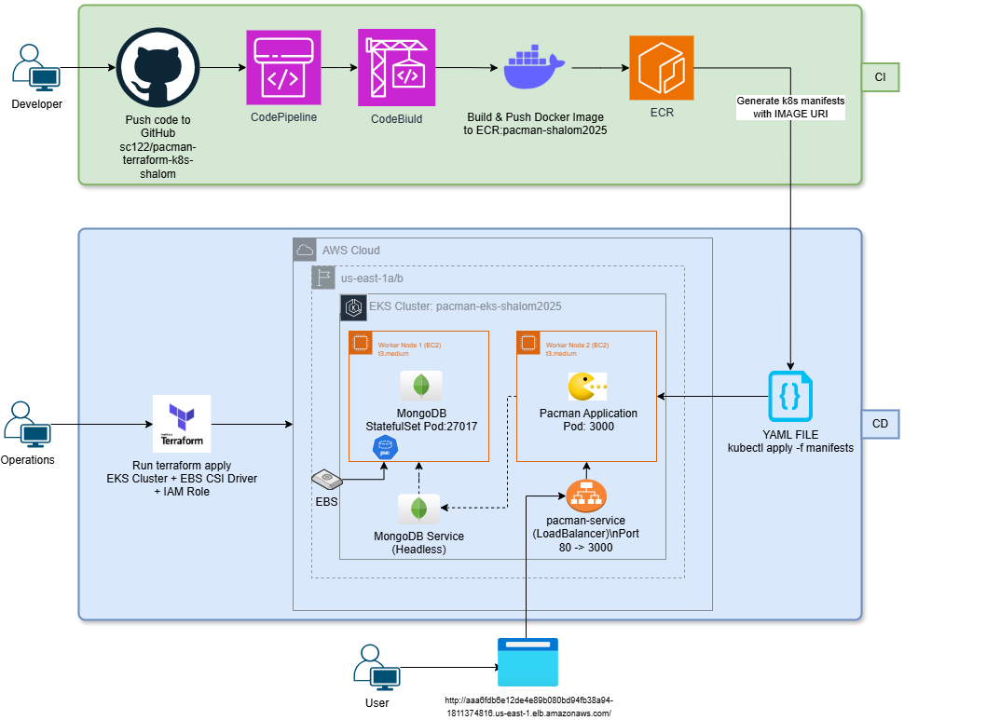
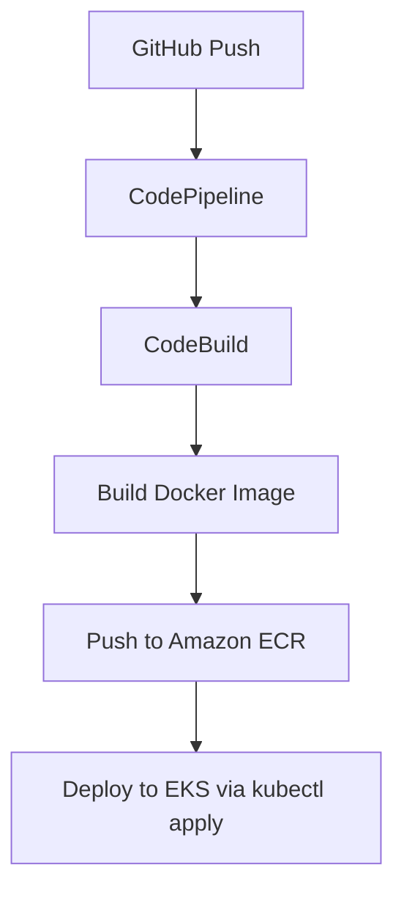

# 🕹️ Pacman on AWS EKS with CI/CD and MongoDB

This project deploys the classic Pacman game as a containerized Node.js application on AWS using a complete CI/CD pipeline, Kubernetes (EKS), MongoDB StatefulSet with persistent EBS storage, and Terraform for infrastructure provisioning.

---

## 📦 Project Stack

| Layer         | Technology                                    |
|--------------|-----------------------------------------------|
| Cloud        | AWS (EKS, ECR, CodeBuild, CodePipeline, IAM) |
| Orchestration| Kubernetes (EKS)                              |
| CI/CD        | GitHub → CodePipeline → CodeBuild → ECR       |
| App          | Node.js Express (Pacman game)                 |
| Database     | MongoDB on StatefulSet with PVC + EBS         |
| Infra as Code| Terraform                                     |

---

## 🚀 Deployment Architecture

- `Deployment` → Pacman App in Node.js
- `StatefulSet` → MongoDB pod with EBS volume
- `PVC` → Uses gp3 StorageClass
- `LoadBalancer` → Public access to Pacman app
- `ClusterIP (None)` → MongoDB headless service

### 🔗 App URL (via ELB)

http://aaa6fdb6e12de4e89b080bd94fb38a94-1811374816.us-east-1.elb.amazonaws.com/

---

## 📷 System Architecture Diagram

---

## 🔌 Port & Network Configuration

| Component      | Port  | Purpose                                 |
|----------------|-------|-----------------------------------------|
| Pacman Pod     | 3000  | Application exposed internally          |
| Service LB     | 80    | Public access via LoadBalancer          |
| MongoDB Pod    | 27017 | Internal DB connection via DNS service  |

- DNS to MongoDB: `mongodb.default.svc.cluster.local:27017`
- Environment variables:
  - `MONGO_SERVICE_HOST=mongodb`
  - `MONGO_DATABASE=pacman`

---

## 💾 MongoDB Persistence (EBS)

- **PVC Name**: `mongo-persistent-storage-mongodb-0`
- **StorageClass**: `gp3`
- **VolumeBindingMode**: `WaitForFirstConsumer`
- **Provisioner**: `ebs.csi.aws.com`
- **IAM Role for CSI**: Enabled via Pod Identity
- **AZ**: us-east-1a or us-east-1b (based on node placement)

---

## ⚙️ CI/CD Pipeline

---

## 🧪 Validation

- ✅ `kubectl logs pacman` → `Connected to database server successfully`
- ✅ ELB URL opens Pacman game
- ✅ MongoDB collection `scores` created automatically
- ✅ PVC is bound to an EBS volume (check via AWS console)

---

## 🗂️ Repository

**GitHub**: https://github.com/sc122/pacman-terraform-k8s-shalom

---

## 👤 Author

**Shalom** (shalom2025)Course Project, AWS

